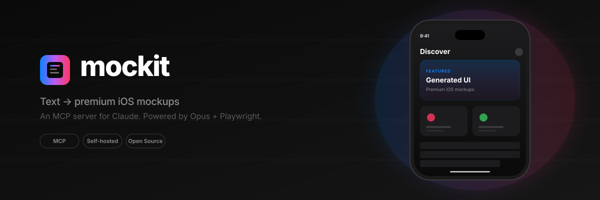

<div align="center">
  

  <h1>mockit-mcp</h1>

  <p><strong>Turn text prompts into premium iOS mobile UI mockups.</strong></p>
  <p>An MCP server that pairs Claude (Opus 4.7 by default) with a Playwright renderer to generate <em>screenshot-grade</em> mobile app designs from natural language.</p>

  <p>
    <a href="#install"></a>
    <a href="LICENSE"></a>
    
    
  </p>
</div>

---

## What it does

Ask Claude Code (or any MCP client):

> *Design the home dashboard for a fitness tracker. Three concentric activity rings, weekly bar chart, recent workouts list, premium dark mode with neon accents.*

`mockit-mcp` returns a real PNG mockup (sized 390×844 at 2x device scale, an iPhone-class viewport) **and** the underlying HTML/Tailwind source — so you can iterate visually and port to SwiftUI when you're ready to build.

It's not a static template engine and it's not generic AI slop. The system prompt is hand-tuned for premium iOS aesthetics: real content, SVG icons (no emoji), tasteful gradients in place of stock photos, iOS HIG type scale, and tonal layering instead of heavy shadows.

<div align="center">
  <table>
    <tr>
      <td align="center"><br/><sub><b>Fitness dashboard</b></sub></td>
      <td align="center"><br/><sub><b>Volume calculator</b> (Turkish)</sub></td>
    </tr>
  </table>
  <p><sub>Generated from a single prompt each. See <a href="examples/">examples/</a>.</sub></p>
</div>

## Highlights

- **Two backends, same tools.** Use the local `claude` CLI (subscription, $0 extra) or the Anthropic API (key + per-call pricing). Switch with one env var.
- **Real PNG output.** Headless Chromium via Playwright. Default viewport is **390×844 @2x** (iPhone-class); any custom size is one env var away.
- **Iterative refinement.** `iterate_screen` takes a screen ID + feedback ("make the hero card smaller") and produces a new version, tracking parent/child.
- **Disk-backed library.** Every generation saves HTML + PNG + JSON metadata. Browse, filter, re-export.
- **MCP standard.** Works with Claude Code, Claude Desktop, Cursor, Windsurf, or any MCP client.
- **Stdio + HTTP transports.** Run locally for dev, or as a network service for shared / containerized use.

## Tools

| Tool | Description |
|------|-------------|
| `generate_screen` | Text brief → PNG + HTML. Optional `design_system` and `project` fields. |
| `iterate_screen`  | Take a previous `screen_id` + `feedback` string, produce a new version. |
| `list_screens`    | List screens, optionally filtered by project. |
| `get_screen`      | Fetch metadata (or full HTML) for a specific screen. |

## Install

### Prerequisites

- **Node.js 20+**
- **Either** the `claude` CLI logged in (`cli` backend, default) **or** an Anthropic API key (`api` backend)
- Playwright's Chromium download (~170 MB, one-time)

### Quick start (CLI backend, recommended for local dev)

```bash
git clone https://github.com/karyaboyraz/mockit-mcp.git
cd mockit-mcp
npm install
npx playwright install chromium
npm run build
```

Add to Claude Code:

```bash
claude mcp add mockit -- node "$(pwd)/dist/server.js"
```

Done. No API key needed — it uses your existing `claude` CLI session.

### API backend (no `claude` CLI on host)

```bash
echo "CLAUDE_BACKEND=api" > .env
echo "ANTHROPIC_API_KEY=sk-ant-..." >> .env
npm run build
claude mcp add mockit -- node "$(pwd)/dist/server.js"
```

### Docker (HTTP transport, for shared deployment)

```bash
cat > .env <<'ENV'
CLAUDE_BACKEND=api
ANTHROPIC_API_KEY=sk-ant-...
# Required if you change the port binding from 127.0.0.1 to 0.0.0.0:
MCP_HTTP_TOKEN=$(openssl rand -hex 32)
ENV
docker compose up -d --build
```

By default `docker-compose.yml` binds the HTTP port to `127.0.0.1` only and the server requires `MCP_HTTP_TOKEN` for any non-loopback request. **Don't expose this server to a public network without setting a strong `MCP_HTTP_TOKEN`** — every generation hits your Anthropic API key.

Then point any client at the loopback URL:

```bash
claude mcp add --transport http mockit http://127.0.0.1:7821/mcp \
  -H "Authorization: Bearer <MCP_HTTP_TOKEN>"
```

For remote access, change `docker-compose.yml`'s port binding to `0.0.0.0:7821:7821` and ensure `MCP_HTTP_TOKEN` is set — the server refuses to start otherwise.

## Usage

In any MCP client, just ask:

> *Design a fitness tracker dashboard. Show today's ring progress, a weekly chart, and a list of recent workouts. Dark mode, neon green accent.*

The PNG appears inline. The HTML is saved to `designs/{project}/{name}-{id}.html`.

For follow-ups:

> *iterate_screen on that fitness dashboard — replace the chart with heart-rate over time, and add a "share workout" button below.*

See [`examples/`](examples/) for prompt patterns and full outputs.

## Configuration

All optional. See [`.env.example`](.env.example) for the full list.

| Env | Default | Notes |
|-----|---------|-------|
| `CLAUDE_BACKEND` | `cli` | `cli` uses the `claude` CLI; `api` uses Anthropic SDK directly |
| `ANTHROPIC_API_KEY` | — | Required only for `api` backend |
| `ANTHROPIC_MODEL` | `claude-opus-4-7` | API backend only. If your account doesn't have Opus access, set to `claude-sonnet-4-6` or `claude-haiku-4-5` |
| `CLAUDE_CLI_PATH` | `claude` | Path to the `claude` binary |
| `CLAUDE_CLI_TIMEOUT_MS` | `180000` | Subprocess timeout |
| `MCP_TRANSPORT` | `stdio` | `stdio` or `http` |
| `HTTP_PORT` | `7821` | HTTP transport port |
| `HTTP_HOST` | `127.0.0.1` | Bind interface; non-loopback requires `MCP_HTTP_TOKEN` |
| `MCP_HTTP_TOKEN` | — | Bearer token for HTTP auth. Required if `HTTP_HOST` is non-loopback |
| `DESIGNS_DIR` | `./designs` | Where outputs are persisted |
| `VIEWPORT_WIDTH` | `390` | Render width in CSS pixels |
| `VIEWPORT_HEIGHT` | `844` | Render height in CSS pixels |
| `DEVICE_SCALE` | `2` | Retina factor (final PNG is `WIDTH × DEVICE_SCALE` wide) |
| `PLAYWRIGHT_NO_SANDBOX` | `auto` | `auto` = sandbox enabled outside containers; `true` to force-disable, `false` to force-enable. Disabling reduces isolation against malicious model HTML — only do so inside a container. |

## Cost

Per generation: ~3K input tokens (system prompt) + ~6–12K output tokens depending on screen complexity. Output dominates the cost on Opus.

| Backend | First call | Cached follow-up |
|---------|-----------|------------------|
| `cli`   | counts against your Claude Code subscription quota | same — cache only discounts the system prompt |
| `api`   | ~$0.50–0.95 (Opus 4.7) | ~$0.45–0.90 (cache discounts the system-prompt input only; output cost is unchanged) |

System-prompt caching is on by default (5-minute TTL). It saves a few cents per call but is **not** an order-of-magnitude discount — output tokens still bill at full rate. For real cost reduction, switch to a smaller model (`claude-sonnet-4-6` or `claude-haiku-4-5`).

## Architecture

```
┌─────────────────┐
│   MCP Client    │  (Claude Code, Cursor, Windsurf, …)
└────────┬────────┘
         │ tool call: generate_screen({ prompt, ... })
         ▼
┌─────────────────────────────────────────────────────┐
│  mockit-mcp                                          │
│                                                      │
│  ┌──────────────┐    ┌────────────────────────┐    │
│  │  Backend     │    │  Renderer              │    │
│  │              │    │                        │    │
│  │ ► cli   ─────┼──► │  Playwright (headless  │    │
│  │ ► api   ─────┘    │  Chromium @ iPhone     │    │
│  │  → HTML+Tailwind  │  viewport)             │    │
│  └──────────────┘    │  → PNG screenshot      │    │
│                      └────────────────────────┘    │
│                                                      │
│  ┌────────────────────────────────────────────┐    │
│  │ Storage (disk): HTML + PNG + JSON metadata │    │
│  └────────────────────────────────────────────┘    │
└─────────────────────────────────────────────────────┘
```

## Storage layout

```
designs/
└── {project-slug}/
    ├── {name-slug}-{id8}.html   # id8 = first 8 chars of the screen UUID
    ├── {name-slug}-{id8}.png
    └── {name-slug}-{id8}.json   # full UUID, prompt, parent ID, tokens, model, cost
```

## Tuning the design voice

The hand-tuned system prompt lives in [`src/system-prompt.ts`](src/system-prompt.ts). It's where the iOS HIG enforcement, the no-stock-photo rule, the SF Pro fallback chain, and the editorial typography preferences are encoded. Want Material You instead, or a desktop dashboard voice? Edit it.

## Development

```bash
npm run dev    # tsx watch mode, stdio transport
npm run http   # tsx watch mode, http transport on :7821
npm run build  # compile to dist/
```

## Roadmap

- [ ] Watch / iPad / Android viewport presets
- [ ] Multi-screen flow generation (onboarding sequences)
- [ ] HTML → SwiftUI / Jetpack Compose port tool
- [ ] Design system import (Tailwind config, design tokens)
- [ ] Image references (use `--image` for visual inspiration)
- [ ] Variant generation (3-5 alternatives per prompt)

## Contributing

Issues and PRs welcome — see [CONTRIBUTING.md](CONTRIBUTING.md).

## License

[MIT](LICENSE)

## Acknowledgements

Built on top of:
- [Anthropic Claude](https://claude.com/) — the model that does the heavy lifting
- [Model Context Protocol](https://modelcontextprotocol.io/) — the integration standard
- [Playwright](https://playwright.dev/) — the renderer
- [Tailwind CSS](https://tailwindcss.com/) — via CDN, in every generated screen

## Trademarks

iPhone, iPad, Apple Watch, and iOS are trademarks of Apple Inc. Claude is a trademark of Anthropic, PBC. mockit-mcp is an independent open-source project and is not affiliated with, endorsed by, or sponsored by Apple Inc. or Anthropic, PBC. All other product names, logos, and brands are property of their respective owners.
