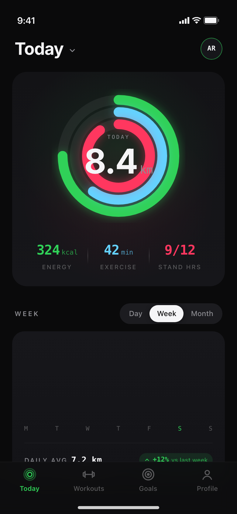
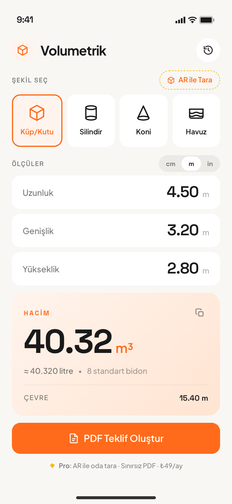

# Examples

Real outputs from `mockit-mcp`. All generated from a single prompt — no manual editing — using the default system prompt and the `cli` backend (Claude Opus 4.7).

## Fitness dashboard



**Prompt** *(abridged)*:

> A premium fitness tracker dashboard. Modern editorial dark mode. Top "Today" headline with a date-picker chevron, profile circle. Hero card with three concentric SVG activity rings (energy / exercise / stand) at 220pt with a subtle glow filter. Center of the rings shows "8.4 km" with a small "TODAY" label above. Below the rings, three stat columns with vertical dividers: 324 kcal (energy), 42min (exercise), 9/12 stand hours.
>
> WEEK section with a Day/Week/Month segmented pill (Week selected). 7-bar weekly chart with today highlighted in neon green; "Daily avg 7.2 km · +12% vs last week" below.
>
> RECENT WORKOUTS list — three cards: Morning Run (6.2 km · 32 min · 412 kcal), Strength Training (Push day · 48 min · 285 kcal), Yoga Flow (25 min · 95 kcal). Each card has a custom SVG icon in a tinted circle.
>
> Bottom tab bar: Today, Workouts, Goals, Profile.

Notable: each ring uses a stroke-dasharray + filter glow for the soft halo. All icons are inline SVGs (no emoji, no external sprite). Numbers are tabular-aligned in Space Grotesk so the bar chart and stat columns line up perfectly.

## Volume / cubage calculator (Turkish)



**Prompt** *(abridged)*:

> Türkçe hacim/kübaj hesaplama uygulaması. Industrial precision aesthetic, light mode (warm off-white #F8F7F4), construction safety orange #FF6B1A accent. Plus Jakarta Sans + Space Grotesk.
>
> Layout: Wordmark + history icon, ŞEKİL SEÇ section with an "AR ile Tara" pill (dashed gold border) and 5 horizontally-scrollable shape cards (Küp/Kutu selected with orange border + tint, Silindir, Koni, Havuz, Düzensiz with AI badge). ÖLÇÜLER section with cm/M/inch toggle and three input cards (Uzunluk 4.50, Genişlik 3.20, Yükseklik 2.80). HACİM result card on a soft orange gradient: "40.32 m³" in Space Grotesk 64pt, with "≈ 40,320 litre · 8 standart bidon" below. MALZEME TAHMİNİ rows (concrete, sand, water with quantities), big "PDF Teklif Oluştur" CTA, and a Pro hint.

Notable: full Turkish localization including idiomatic terms (ölçüler, hacim, malzeme, teklif, sahada-anlaşılır references like *standart bidon*).

## Prompt patterns that work

A few habits that produce consistently good results:

- **Lead with the app's purpose and audience.** "Fitness tracker for runners who care about heart-rate zones" beats "fitness app".
- **Pick a vibe.** Editorial / Industrial / Playful / Brutalist / Minimal / Tactile. The system prompt already enforces premium iOS aesthetics, but a vibe nudges flavor.
- **Specify the type system explicitly** if you want non-default fonts. The system prompt includes Inter, Space Grotesk, Playfair Display, and Plus Jakarta Sans by default.
- **Describe the layout top-to-bottom**, listing each section's purpose and content. The model maps these to real Tailwind layouts.
- **Use real numbers and copy.** "$14,200" beats "{price}". "6.2 km · 32 min · 412 kcal" beats "{distance} {duration} {calories}".
- **For non-English UIs, write the labels in the target language** — the model handles diacritics correctly when you do (e.g., *Ölçüler*, *Yükseklik*).
- **Skip stock-photo placeholders.** The system prompt already replaces images with tasteful gradient meshes; just describe the subject ("a deep navy gradient evoking a calm running trail at dawn").
- **Avoid real-world brand names.** The system prompt steers away from trademarked product names — say "a luxury sports watch" rather than naming a specific brand.

## Re-running these locally

```bash
# After install (see main README)
claude mcp add mockit -- node "$(pwd)/dist/server.js"
```

Then in Claude Code:

> *Use generate_screen to make a fitness tracker dashboard with three activity rings, a weekly bar chart, and a recent workouts list.*

Adjust prompts, then `iterate_screen` for refinements.
